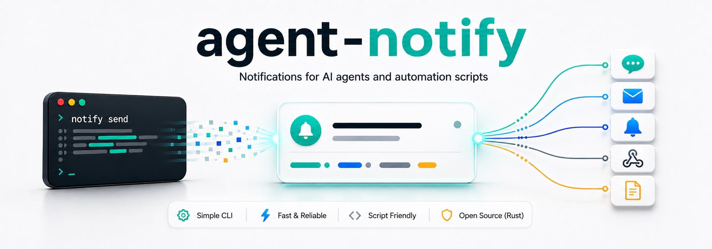

# agent-notify

[](https://crates.io/crates/agent-notify)
[](Cargo.toml)
[](Cargo.toml)

A notification CLI for AI agents and automation scripts.



`agent-notify` provides the `notify` command for sending messages and generated files through configured notification channels.

```bash
notify send --channel personal --title "Task completed" --body "The report is ready." --file ./report.pdf
```

## Supported Channels

* `file-log`
* `telegram`
* `discord-webhook`
* `discord-bot`
* `ntfy`
* `slack-webhook`
* `pushover`
* `gotify`
* `webhook`

The CLI can load, check, and send through the channel types above. External channel types require their configured service credentials or environment variables.


## Installation

Install from crates.io:

```bash
cargo install agent-notify
```

This installs the `notify` binary.

To build from this repository instead:

```bash
cargo build --release
```

The local build writes the binary to:

```text
target/release/notify
```

## Quick Start

Create `notify.toml`:

```toml
default_channel = "local"

[channels.local]
type = "file-log"
path = "./notify-log"
```

Send a notification:

```bash
notify send --title "Hello" --body "Hello from agent-notify."
```

This writes a local JSONL log under `./notify-log`.

## Concepts

A `channel` is the configured destination name that users and agents select, such as `personal`, `team`, `phone`, `local`, or `automation`.

Channel names are user-defined. The examples in this document are conventional names only; you can name channels for your own workflow, such as `ops`, `alerts`, `desktop-log`, or `prod-slack`.

A channel has a `type`, which controls how the notification is delivered:

```text
telegram
discord-webhook
discord-bot
ntfy
slack-webhook
pushover
gotify
webhook
file-log
```

Agents should use channel names and should not need to know service credentials or provider-specific API details.

## Configuration

`notify` looks for configuration in this order:

1. `--config <path>`
2. `./notify.toml`
3. `~/.config/agent-notify/config.toml`

Sample files are included under:

```text
examples/notify.toml
examples/notify.env.example
```

### Secrets

Secret-like values can be configured inline or through environment variables.

Recommended:

```toml
[channels.team]
type = "discord-webhook"
webhook_url_env = "NOTIFY_DISCORD_WEBHOOK_URL"
```

```bash
export NOTIFY_DISCORD_WEBHOOK_URL="https://discord.com/api/webhooks/..."
```

Quick setup:

```toml
[channels.team]
type = "discord-webhook"
webhook_url = "https://discord.com/api/webhooks/..."
```

Environment variables are recommended for shared repositories, CI, and agent workflows.

Secrets are not accepted as CLI arguments.

Invalid:

```bash
notify send --webhook-url "https://discord.com/api/webhooks/..." --title "Hello" --body "World"
```

Also invalid:

```toml
webhook_url = "https://discord.com/api/webhooks/..."
webhook_url_env = "NOTIFY_DISCORD_WEBHOOK_URL"
```

Use either the inline field or the `_env` field, not both.

### Channel Types

#### `file-log`

Stores notifications in a local JSONL file and copies attachments under a child directory.

```toml
[channels.local]
type = "file-log"
path = "./notify-log"
```

Use this for local testing or CI verification.

#### `telegram`

```toml
[channels.personal]
type = "telegram"

# Required. Use *_env for shared configs and agent workflows.
bot_token_env = "NOTIFY_TELEGRAM_BOT_TOKEN"
chat_id_env = "NOTIFY_TELEGRAM_CHAT_ID"

# Quick local setup can use inline values instead:
# bot_token = "123456:ABC..."
# chat_id = "123456789"

# Optional. Defaults to "plain". Supported: "plain", "html", "markdown-v2".
# parse_mode = "plain"
```

#### `discord-webhook`

```toml
[channels.team]
type = "discord-webhook"

# Required.
webhook_url_env = "NOTIFY_DISCORD_WEBHOOK_URL"

# Quick local setup can use an inline URL instead:
# webhook_url = "https://discord.com/api/webhooks/..."

# Optional display controls.
# username = "Agent Notify"
# avatar_url = "https://example.com/avatar.png"
# allow_mentions defaults to false. Set true to allow Discord mentions.
# allow_mentions = false
```

#### `discord-bot`

```toml
[channels.bot_team]
type = "discord-bot"

# Required.
bot_token_env = "NOTIFY_DISCORD_BOT_TOKEN"
channel_id_env = "NOTIFY_DISCORD_CHANNEL_ID"

# Quick local setup can use inline values instead:
# bot_token = "..."
# channel_id = "123456789012345678"

# Optional. Defaults to false.
# allow_mentions = false
```

#### `ntfy`

```toml
[channels.phone]
type = "ntfy"

# Required.
topic_env = "NOTIFY_NTFY_TOPIC"

# Quick local setup can use an inline topic instead:
# topic = "my-topic"

# Optional. Defaults to "https://ntfy.sh".
# server = "https://ntfy.sh"

# Optional bearer token, depending on your ntfy server/topic.
# token_env = "NOTIFY_NTFY_TOKEN"
# token = "..."
```

#### `slack-webhook`

```toml
[channels.chat]
type = "slack-webhook"

# Required.
webhook_url_env = "NOTIFY_SLACK_WEBHOOK_URL"

# Quick local setup can use an inline URL instead:
# webhook_url = "https://hooks.slack.com/services/..."

# Optional display controls.
# username = "Agent Notify"
# icon_emoji = ":robot_face:"
# icon_url = "https://example.com/icon.png"
# allow_mentions defaults to false. Set true to allow Slack mass mentions.
# allow_mentions = false
```

Incoming webhook messages are sent as JSON. Attachments are not supported by this channel type.

#### `pushover`

```toml
[channels.mobile]
type = "pushover"

# Required.
token_env = "NOTIFY_PUSHOVER_TOKEN"
user_env = "NOTIFY_PUSHOVER_USER"

# Quick local setup can use inline values instead:
# token = "app-token"
# user = "user-or-group-key"

# Optional routing and sound controls.
# device = "phone"
# sound = "pushover"
```

Attachments are not supported by this channel type.

#### `gotify`

```toml
[channels.self_hosted]
type = "gotify"

# Required.
server = "https://gotify.example.com"
token_env = "NOTIFY_GOTIFY_TOKEN"

# Quick local setup can use an inline token instead:
# token = "app-token"

# Optional. Overrides the priority mapped from --priority.
# priority = 5
```

Attachments are not supported by this channel type.

#### `webhook`

```toml
[channels.automation]
type = "webhook"

# Required.
url_env = "NOTIFY_WEBHOOK_URL"

# Quick local setup can use an inline URL instead:
# url = "https://example.com/notify"

# Optional Authorization header.
# auth_header_env = "NOTIFY_WEBHOOK_AUTH_HEADER"
# auth_header = "Bearer secret"

# Optional. Defaults to 15.
# timeout_seconds = 15
```

The webhook channel uses the project-defined webhook protocol. The v1 payload format is defined in `docs/webhook-v1.md`.

## Commands

### `notify send`

Send a notification.

```bash
notify send --channel personal --title "Task completed" --body "The report was generated successfully."
```

Use the default channel:

```bash
notify send --title "Task completed" --body "Done."
```

Send to multiple channels:

```bash
notify send --channel personal --channel team --title "Task completed" --body "Done."
```

Attach a file:

```bash
notify send \
  --channel local \
  --title "Chart ready" \
  --body "Attached chart image." \
  --file ./chart.png
```

Read body from a file:

```bash
notify send \
  --channel local \
  --title "Error summary" \
  --body-file ./error-summary.md
```

Dry run:

```bash
notify send \
  --channel local \
  --title "Chart ready" \
  --body "Attached chart image." \
  --file ./chart.png \
  --dry-run
```

Common options:

```text
--channel <name>       Channel name. Can be repeated. Uses default_channel if omitted.
--title <text>         Notification title.
--body <text>          Notification body.
--body-file <path>     Read body from a file.
--file <path>          Attach a file. Can be used multiple times.
--priority <level>     info | success | warning | error | critical
--format <format>      text | markdown
--tag <tag>            Add a tag. Can be used multiple times.
--dry-run              Resolve and display the notification without sending it.
--json                 Emit JSON output.
--config <path>        Use a specific config file.
```

### `notify channels`

List configured channels.

```bash
notify channels
```

Example:

```text
personal     telegram          ready
team         discord-webhook   ready
phone        ntfy              ready
chat         slack-webhook     ready
mobile       pushover          ready
self_hosted  gotify            ready
local        file-log          ready
automation   webhook           ready
```

### `notify check`

Validate configuration.

```bash
notify check
```

Check one channel:

```bash
notify check --channel personal
```

### `notify test`

Send a test notification.

```bash
notify test --channel local
```

## Webhook Protocol v1

The `webhook` channel sends the agent-notify webhook protocol v1 payload.

Without attachments, the request is `application/json`. With attachments, the request is `multipart/form-data` with a `payload` JSON part and file parts named `file0`, `file1`, and so on.

The full protocol is documented in:

```text
docs/webhook-v1.md
```

## Examples

### Local test

```toml
default_channel = "local"

[channels.local]
type = "file-log"
path = "./notify-log"
```

```bash
notify send --title "Local test" --body "This notification is stored locally."
```

### Discord webhook

```toml
default_channel = "team"

[channels.team]
type = "discord-webhook"
webhook_url_env = "NOTIFY_DISCORD_WEBHOOK_URL"
```

```bash
export NOTIFY_DISCORD_WEBHOOK_URL="https://discord.com/api/webhooks/..."

notify send --title "Deployment complete" --body "The deployment finished successfully."
```

### Telegram

```toml
default_channel = "personal"

[channels.personal]
type = "telegram"
bot_token_env = "NOTIFY_TELEGRAM_BOT_TOKEN"
chat_id_env = "NOTIFY_TELEGRAM_CHAT_ID"
```

```bash
export NOTIFY_TELEGRAM_BOT_TOKEN="123456:ABC..."
export NOTIFY_TELEGRAM_CHAT_ID="123456789"

notify send --title "Job failed" --priority error --body "The nightly job failed."
```

### ntfy

```toml
default_channel = "phone"

[channels.phone]
type = "ntfy"
topic_env = "NOTIFY_NTFY_TOPIC"
```

```bash
export NOTIFY_NTFY_TOPIC="my-private-topic"

notify send --title "Attention needed" --priority warning --body "The agent needs attention."
```

### Webhook

```toml
default_channel = "automation"

[channels.automation]
type = "webhook"
url_env = "NOTIFY_WEBHOOK_URL"
```

```bash
export NOTIFY_WEBHOOK_URL="https://example.com/notify"

notify send --title "Report ready" --body "The report is ready." --file ./report.pdf
```

## Agent Skill

This repository includes an Agent Skill under:

```text
skills/notification/
```

Use it when installing `agent-notify` into an AI agent environment.

Install the CLI first:

```bash
cargo install agent-notify
```
